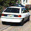
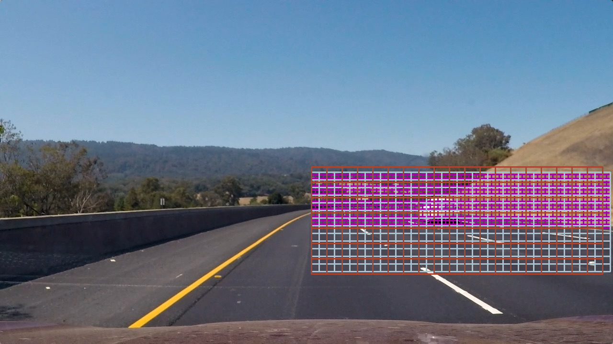

# Udacity Project 5 - Vehicle Lane Detection

The aim of this project is to build a pipeline to detect cars from windshield mounted camera. This is done using traditional computer vision techniques.

 Training Data Overview
---

The project repository on the Udacity github has links to two prepreared data sets. The first containing [images of vehicles](https://s3.amazonaws.com/udacity-sdc/Vehicle_Tracking/vehicles.zip) and the second conatining images of [of no vehicles](https://s3.amazonaws.com/udacity-sdc/Vehicle_Tracking/non-vehicles.zip).

Car Images | | | | |
-----------|---------------|---------------|---------------|---------------|
 | | | | 

Not Car Images | | | | |
-----------|---------------|---------------|---------------|---------------|
 | | | | 

[Rubric Points](https://review.udacity.com/#!/rubrics/513/view)
---

### Explain how (and identify where in your code) you extracted HOG features from the training images. Explain how you settled on your final choice of HOG parameters

On loading the data I generated a small data subset in section 4. Then in section 8 I have some code which will take a given colour space and plot the accumulated colour histogram for the whole data subset, plot the individual channels for the colour space and give an example of a histogram feature.

From sections 9 to 15 I look at the results for RGB, HSV, LUV, HLS, LAB, YUV, and YCrCb.  In the second and third channels of the accumulated colour histogram for the YCrCb colour space there is a prominent feature which appears in the 'car' data set but not the 'notCar' data set. Meanwhile the first channel of the colour space provides a very clear image of the car and is therefore useful for building a histogram of orientated gradient feature.

### Describe how (and identify where in your code) you trained a classifier using your selected HOG features (and color features if you used them).

In section 17 I used a liner support vector machine to train my classifier. A linear classifier runs faster and is less prone to over fitting than alternative SVM classifiers. I used 9 HOG orientations - I found increasing this value did not increase the accuracy of my classifier but made it take longfer to run. Likewise I found increasing the cells per block above 2 did not have a noticable increase in performance.

To completment the HOG classifier which I ran on the first channel of the YCrCB colour channel I also used a spatial bining feature extractor with binning dimensions of (32,32) and I used a colour histogram feature on the second two channels of the YCrCb colour space.

This results in a feature vector with a length of 11236, this is quite long and with more time could be refined however it achieves a training accuracy of ~98% on the test set.

### Describe how (and identify where in your code) you implemented a sliding window search. How did you decide what scales to search and how much to overlap windows?

In section 16 I define a sliding windows search function. The function first looks at small windows around the middle of the image. It the loops to look at increasingly large windows in the lower half of the image. This is to account for the fact that cars are on the bottom half of the image and cars which are closer appear larger.

There is an overlap of 75% between windows.

### Show some examples of test images to demonstrate how your pipeline is working. How did you optimize the performance of your classifier?

To remove false positives from my detections I apply a heatmap to each image classified. A heatmap is a function which only draws bounding boxes in areas where multiple detections exist.

To further smooth my detections when applying the pipeline to a video I created a data class in section 23 which stores the heatmap for the last 10 frames.

### Video

Here is the video working running on the test video.

Here is the pipeline working on the full project video.

### Discussion
The feature vector I created is far too long and as such it takes a long time to run as a pipeline. While it is reasonable at detecting vehicles it is not capable of running even close to real time. I will revist my classifier and see if I can reduce its size whilst maintaining its accuracy. Also the bounding boxes though detecting cars currentlyu do a poor job of fitting the box around the whole vehicle, potentially I could solve this by modifying my hot box parameters and using more training data.

A number of people have had success using nueral network object detectors to run this project, and as these utilise GPU's will run faster. There are GPU's for autombiles coming on to the market however for current technology my understanding is that CPU's still rule the roost in commercial vehicles.